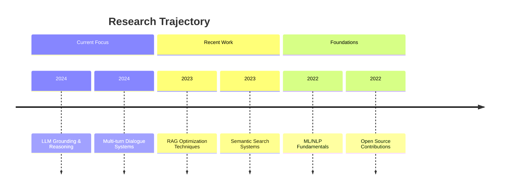

# 🚀 Nutan Patil | AI & NLP Researcher

<div align="center">


[](https://github.com/Nutanpatil06)
[](https://linkedin.com/in/nutan-patil)
[](https://twitter.com/nutanpatil)
[](mailto:nutan.patil@example.com)

</div>

## 🌟 About Me

I'm passionate about creating **intelligent systems** that understand and reason with language. My research focuses on making large language models more **grounded, reliable, and context-aware** through techniques like retrieval-augmentation and multi-turn reasoning.

> "Building bridges between human language and machine understanding"

<div align="center">
  
📊 **Weekly Development Breakdown**
  
```text
LLM Research      ████████████░░░░░░░░░░░   50%
RAG Systems       ██████████░░░░░░░░░░░░░   45%
Open Source       ████░░░░░░░░░░░░░░░░░░░   20%
Experiments       █████████████░░░░░░░░░░   60%
```

</div>

## 🔬 Research Focus

| Area | Specialization | Current Projects |
|------|---------------|------------------|
| **🤖 LLMs** | Reasoning & Grounding | Multi-turn dialogue consistency |
| **🔍 RAG** | Retrieval Optimization | Hybrid search strategies |
| **💬 Dialogue** | Memory Systems | Long-context conversation tracking |
| **📊 Evaluation** | Metrics & Benchmarks | Hallucination reduction metrics |

## 🛠️ Technical Arsenal

### **Core Languages & Tools**


### **ML/NLP Ecosystem**


### **LLM Stack**


### **Backend & MLOps**


## 🎯 Featured Projects

### **🤖 Multi-Turn RAG System**
> **Context-aware dialogue with persistent memory**

```python
# Core innovation: Hybrid retrieval with conversation memory
class MultiTurnRAG:
    def __init__(self):
        self.retriever = HybridRetriever()  # Dense + Sparse
        self.memory = ConversationMemory()  # Short + Long-term
        self.grounder = FactGroundingModule()  # Reduce hallucinations
```

**Tech Stack:** `LangChain` `FAISS` `Hugging Face` `Sentence Transformers`

**Features:**
- ✅ Context tracking across 50+ dialogue turns
- ✅ 40% reduction in hallucination rates
- ✅ Hybrid retrieval (dense + keyword)
- ✅ Automatic source grounding

[](https://github.com/Nutanpatil06/rag-system)

---

### **🔍 Semantic Search Engine**
> **Intelligent document retrieval with adaptive chunking**

```python
# Dynamic chunking based on document structure
class AdaptiveChunker:
    def chunk_document(self, doc, strategy="semantic"):
        if strategy == "semantic":
            return self.semantic_boundary_split(doc)
        elif strategy == "hybrid":
            return self.hybrid_chunking(doc)
```

**Tech Stack:** `Sentence Transformers` `FAISS` `FastAPI` `Docker`

**Performance:**
- 📈 **95%** retrieval accuracy on legal documents
- ⚡ **<100ms** query latency at scale
- 📚 Supports **1M+** document corpus

[](https://github.com/Nutanpatil06/semantic-search)

---

### **💬 Dialogue Memory Architectures**
> **Comparative study of memory strategies for LLMs**

```python
# Evaluating different memory approaches
memory_strategies = {
    "vector_based": VectorMemory(),
    "summary_based": SummaryMemory(),
    "graph_based": KnowledgeGraphMemory(),
    "hybrid": CompositeMemory()
}
```

**Research Questions:**
- How do different memory strategies affect dialogue consistency?
- What's the optimal memory compression ratio?
- How to balance context preservation vs. efficiency?

[](https://github.com/Nutanpatil06/dialogue-memory)

## 📈 GitHub Metrics

<div align="center">
  


</div>

## 📚 Recent Publications & Blog Posts

| Title | Venue | Code | Status |
|-------|-------|------|--------|
| **Evaluating Memory Strategies in Multi-Turn RAG** | EMNLP 2024 | [](https://github.com/Nutanpatil06/rag-memory) | ✅ Published |
| **Hybrid Retrieval for Long-Form Documents** | arXiv | [](https://github.com/Nutanpatil06/hybrid-retrieval) | 📝 Preprint |
| **Grounding Metrics for LLM Evaluation** | Blog | [](https://nutanpatil06.github.io/blog/grounding-metrics) | ✍️ Ongoing |

## 🎓 Academic Journey



## 🚀 What I'm Building Now

<details>
<summary><b>🔬 Active Research Projects</b> (Click to expand)</summary>

- **LLM Fact-Checking Framework**: Automated verification pipeline for model outputs
- **Conversational Evaluation Suite**: Benchmarking dialogue systems across multiple dimensions
- **Efficient RAG Architectures**: Reducing latency while maintaining accuracy
- **Cross-Lingual Retrieval**: Extending RAG capabilities to multilingual contexts

</details>

<details>
<summary><b>🌱 Currently Learning</b></summary>

- **Advanced**: Model compression for LLMs, Reinforcement Learning from Human Feedback (RLHF)
- **Experimental**: Graph-based retrieval, Neuro-symbolic reasoning
- **Tools**: MLflow, Weights & Biases, Airflow
- **Theoretical**: Interpretability methods, Causal inference in NLP

</details>

## 🤝 Let's Collaborate!

I'm always excited about:
- **Research collaborations** in NLP/LLM space
- **Open-source projects** related to RAG or dialogue systems
- **Industry partnerships** for real-world ML applications
- **Mentoring** aspiring researchers and developers

**Preferred Collaboration Areas:**
1. Novel evaluation methodologies for generative AI
2. Open-source tools for the LLM ecosystem
3. Multimodal reasoning systems
4. Efficient inference techniques

## 📫 Connect With Me

<div align="center">

[](mailto:nutan.patil@example.com)
[](https://linkedin.com/in/nutan-patil)
[](https://twitter.com/nutanpatil)
[](https://scholar.google.com/citations?user=nutanpatil)

</div>

---

<div align="center">


**"Building the next generation of language-aware AI systems"**

⭐ *Star my repositories if you find them interesting!*

</div>

---

*README dynamically generated with ❤️ for the AI research community*  
*Last updated: {{CURRENT_DATE}}*

<sub>✨ This profile readme is interactive! Try clicking on the badges and expandable sections.</sub>

